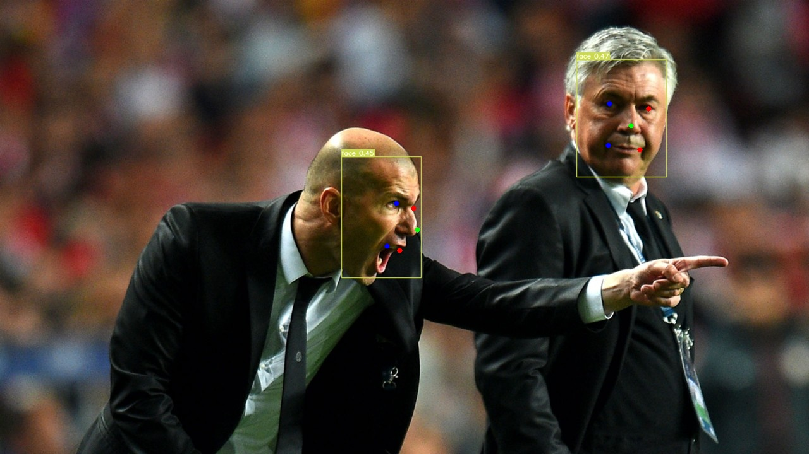

# YOLOV7 Face Detection

Custom Yolov7 to detection face and estimation landmark.

<div align="center">
    <a href="./">
        
    </a>
</div>

<div align="center">
    <a href="./">
        
    </a>
</div>

<div align="center">
    <a href="./">
        
    </a>
</div>

## Performance

| Name        | Dataset    | Epoch | Easy   | Medium | Hard   |
| ----------- | ---------- | ----- | ------ | ------ | ------ |
| yolov7-tiny | Winderface | 80    | 0.9402 | 0.9197 | 0.8038 |

## Data preparation

- Download and extract [winderface](http://shuoyang1213.me/WIDERFACE/index.html) dataset.
- Download and extract annotation file [retinaface_gt_v1.1.zip](https://github.com/deepinsight/insightface/tree/master/detection/retinaface).
- Download [ground_truth](https://github.com/deepcam-cn/yolov5-face/tree/master/widerface_evaluate/ground_truth).
- Folder after download and extract all:
  ```
  - ./winderface
      - WIDER_test/
          - images/
              - 0--Parade/
              - ...
      - WIDER_train/
          - images/
              - 0--Parade/
              - ...
      - WIDER_val/
          - images/
              - 0--Parade/
              - ...
      - train/
          - labels.txt
      - val/
          - labels.txt
      - test/
          - labels.txt
      - ground_truth/
          - wider_easy_val.mat
          - wider_medium_val.mat
          - wider_hard_val.mat
          - wider_face_val.mat
  ```
- Modify path of `winderface` folder in [./data/winderface.yaml](./data/winderface.yaml)

## Detect

- `python3 detect.py --weights ./weights/yolov7-tiny.pt --source inference/images --img-size 640 --conf-thres 0.2 --iou-thres 0.5 --device 1 --no-trace`

## Testing

- `python3 eval.py --weights ./weights/yolov7-tiny.pt --data-root ./winderface --img-size 640 --conf-thres 0.02 --iou-thres 0.5 --device 0 --no-trace`

- `python3 evaluation/main.py -p ./outputs -g ./winderface/ground_truth`

## Training

- Download file [yolov7-tiny.pt](https://github.com/WongKinYiu/yolov7/releases/tag/v0.1) and save as `./weights/yolov7-tiny-origin.pt`.
- Single GPU training: `python3 ./train.py --device 0 --batch-size 16 --data data/widerface.yaml --img 640 640 --cfg cfg/yolov7-tiny-landmark.yaml --weights ./weights/yolov7-tiny-origin.pt --name yolov7-tiny --hyp data/hyp.scratch.tiny.yaml --noautoanchor --linear-lr --epochs 80`

- Multiple GPU training: `torchrun --standalone --nnodes=1 --nproc_per_node 2 ./train.py --device 0,1 --batch-size 16 --data data/widerface.yaml --img 640 640 --cfg cfg/yolov7-tiny-landmark.yaml --weights ./weights/yolov7-tiny.pt --name yolov7-tiny --hyp data/hyp.scratch.tiny.yaml --noautoanchor --sync-bn --linear-lr --epochs 80`

## Bugs

- val/llmks_loss = 0?

## Acknowledgments

- [WongKinYiu/yolov7](https://github.com/WongKinYiu/yolov7)
- [deepcam-cn/yolov5-face](https://github.com/deepcam-cn/yolov5-face)
